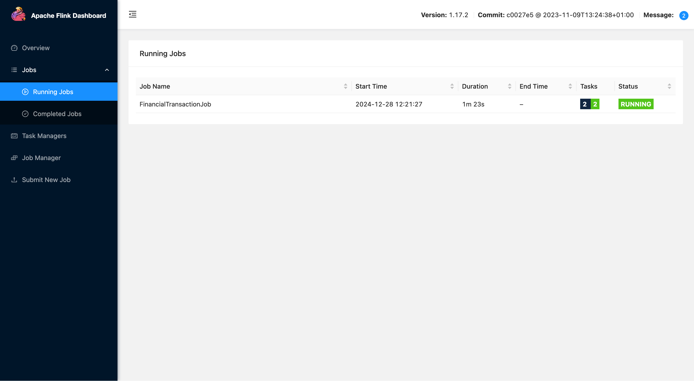
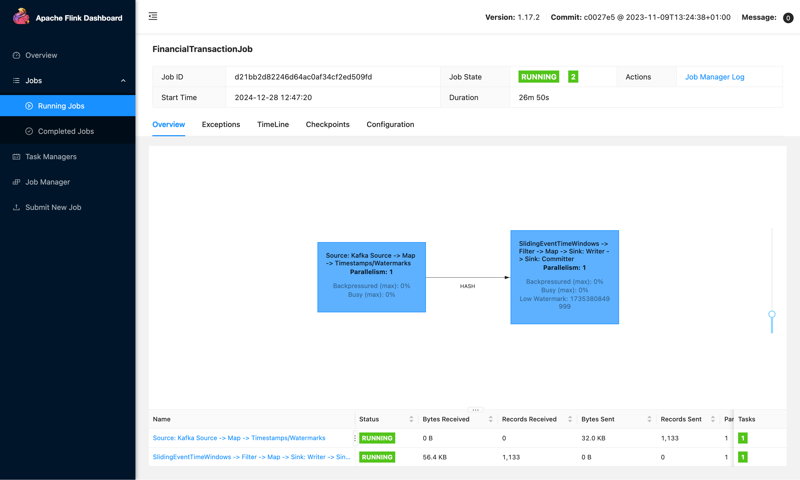
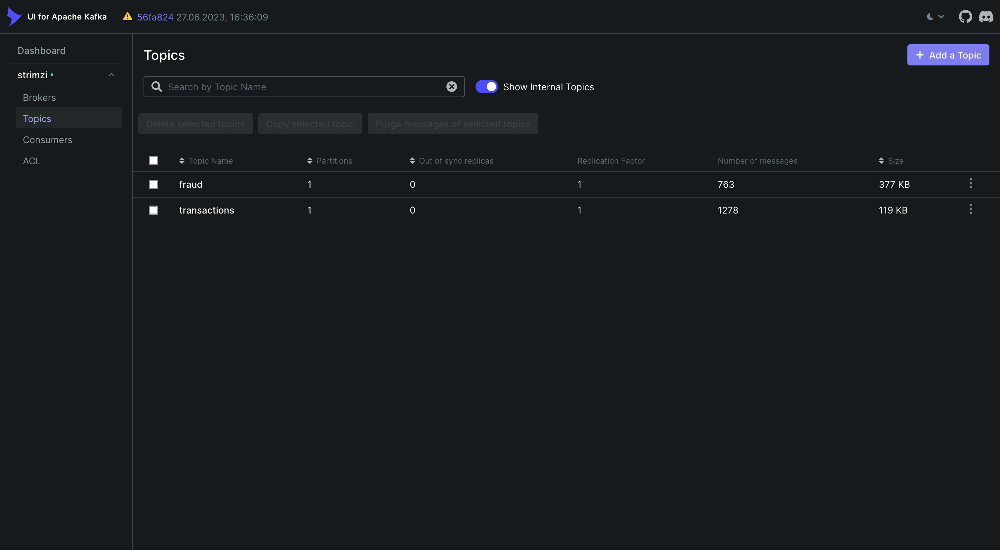

# flink-kafka-k8s-example

Устанавливаем cert manager нужен для работы admission webhook
```
kubectl create -f https://github.com/jetstack/cert-manager/releases/download/v1.8.2/cert-manager.yaml
```

Устанавливаем flink-operator и flink
```bash
helm repo add flink-operator-repo https://downloads.apache.org/flink/flink-kubernetes-operator-1.10.0/
helm install flink-kubernetes-operator flink-operator-repo/flink-kubernetes-operator
kubectl apply -f flink.yaml
````

Устанавливаем kafka-operator и kafka
```bash
helm install my-strimzi-kafka-operator oci://quay.io/strimzi-helm/strimzi-kafka-operator --version 0.45.0
kubectl apply -f kafka.yaml
```

Устанавливаем kafka-ui
```bash
helm repo add kafka-ui https://provectus.github.io/kafka-ui-charts
helm install -f kafka-ui.yaml my-kafka-ui appscode/kafka-ui --version 2024.7.3-rc.0
```

Пробрасываем порт из kubernetes на локальную машину для flink-ui
```bash
export POD_NAME=$(kubectl get pods --namespace default -l "app=basic-example,component=jobmanager" -o jsonpath="{.items[0].metadata.name}")
kubectl --namespace default port-forward $POD_NAME 8081:8081
```

Пробрасываем порт из kubernetes на локальную машину для kafka-ui
```bash
export POD_NAME=$(kubectl get pods --namespace default -l "app.kubernetes.io/name=kafka-ui,app.kubernetes.io/instance=my-kafka-ui" -o jsonpath="{.items[0].metadata.name}")
kubectl --namespace default port-forward $POD_NAME 8080:8080
```

Запускам генератор транзакций
```
kubectl apply -f fraud-generator.yaml
```

Далее собираем jar для flink-job
```
cd flink-job
mvn clean package
```

Загружаем в UI job и запускам


Видимо что job запущена


Видимо что в kafka ui появились топики с транзакциями и результатам проверки фрода



